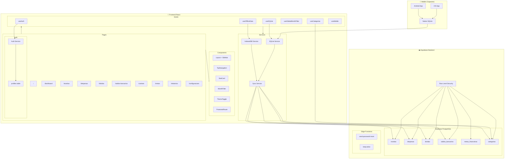
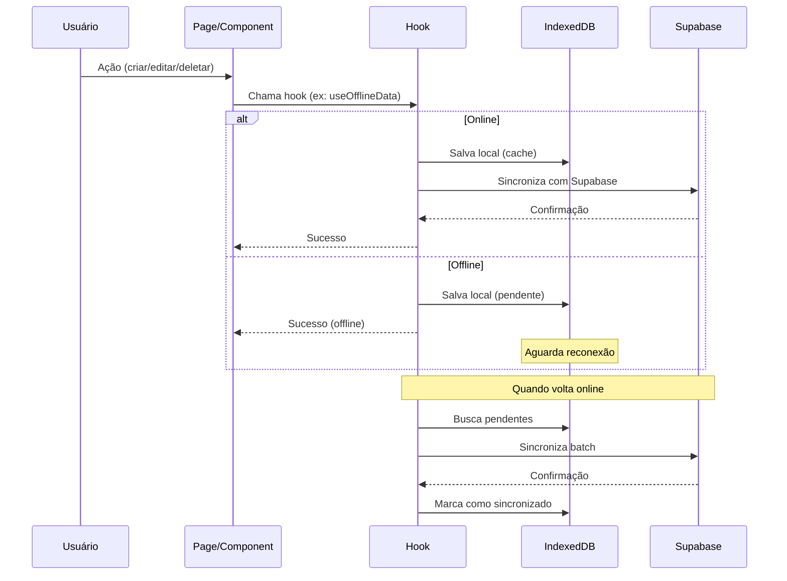

# Arquitetura do Finanza

Este documento descreve a arquitetura técnica do aplicativo Finanza.

## Visão Geral da Arquitetura



---

## Fluxo de Dados



---

## Modelo de Segurança

```mermaid
graph LR
    subgraph "Cliente"
        App["React App"]
    end
    
    subgraph "Autenticação"
        JWT["JWT Token"]
        Session["Session"]
    end
    
    subgraph "Supabase"
        API["API Gateway"]
        RLS["RLS Policies"]
        DB[(PostgreSQL)]
    end
    
    App -->|1. Login| JWT
    JWT -->|2. Token| Session
    Session -->|3. Request + Token| API
    API -->|4. Valida auth.uid()| RLS
    RLS -->|5. Filtra user_id| DB
    DB -->|6. Dados do usuário| App
```

---

## Stack Tecnológica

### Frontend
| Tecnologia | Uso |
|------------|-----|
| React 18 | Framework UI |
| TypeScript | Tipagem estática |
| Vite | Build tool |
| Tailwind CSS | Estilização |
| shadcn/ui | Componentes UI |
| React Router | Navegação |
| React Query | Estado servidor |
| Framer Motion | Animações |
| Recharts | Gráficos |

### Backend (Supabase)
| Tecnologia | Uso |
|------------|-----|
| PostgreSQL | Banco de dados |
| Row Level Security | Segurança por usuário |
| Edge Functions | Lógica serverless |
| Auth | Autenticação |

### Mobile (Capacitor)
| Tecnologia | Uso |
|------------|-----|
| Capacitor Core | Bridge nativo |
| SQLite | Persistência local |
| Android/iOS | Plataformas nativas |

### Offline Support
| Tecnologia | Uso |
|------------|-----|
| IndexedDB | Cache web |
| SQLite | Cache mobile |
| Service Worker | PWA offline |

---

## Estrutura de Pastas

```
src/
├── assets/              # Imagens e recursos estáticos
├── components/
│   ├── ui/              # Componentes shadcn/ui
│   └── *.tsx            # Componentes customizados
├── hooks/               # React hooks customizados
├── integrations/
│   └── supabase/        # Cliente e tipos Supabase
├── pages/               # Páginas/rotas da aplicação
├── services/
│   ├── indexeddb/       # Serviço IndexedDB (web)
│   └── sqlite/          # Serviço SQLite (mobile)
├── utils/               # Funções utilitárias
└── lib/                 # Configurações (cn, etc.)

docs/
├── PRD.md               # Product Requirements Document
├── ARCHITECTURE.md      # Este arquivo
└── CLONE_PROMPT.md      # Prompt para clonar o projeto

supabase/
├── functions/           # Edge Functions
├── migrations/          # Migrações do banco
└── config.toml          # Configuração Supabase

public/
├── pwa-*.png            # Ícones PWA
└── *.ico                # Favicons
```

---

## Tabelas do Banco de Dados

| Tabela | Descrição |
|--------|-----------|
| `profiles` | Perfis de usuário (vinculado ao auth.users) |
| `receitas` | Entradas/receitas financeiras |
| `despesas` | Saídas/despesas (suporta recorrentes) |
| `dividas` | Dívidas com tracking de pagamento |
| `saldos_bancarios` | Contas bancárias |
| `metas_financeiras` | Metas com progresso |
| `categorias` | Categorias customizadas por tipo |

Todas as tabelas possuem:
- `id` (UUID, PK)
- `user_id` (UUID, FK para auth.users)
- `created_at`, `updated_at` (timestamps)
- RLS habilitado com políticas por usuário

---

## Edge Functions

| Função | Endpoint | Descrição |
|--------|----------|-----------|
| `send-password-reset` | `/functions/v1/send-password-reset` | Envia email de recuperação de senha |
| `keep-alive` | `/functions/v1/keep-alive` | Mantém conexão ativa |

---

## Hooks Principais

| Hook | Responsabilidade |
|------|------------------|
| `useAuth` | Autenticação (login, signup, logout, reset) |
| `useOfflineData` | Cache IndexedDB + sync Supabase |
| `useSQLite` | Cache SQLite para mobile |
| `useCategorias` | CRUD de categorias |
| `useGlobalMonthFilter` | Filtro de mês persistente |
| `useMobile` | Detecção de dispositivo móvel |
| `useAccessibility` | Preferências de acessibilidade |

---

*Última atualização: Janeiro 2026*
